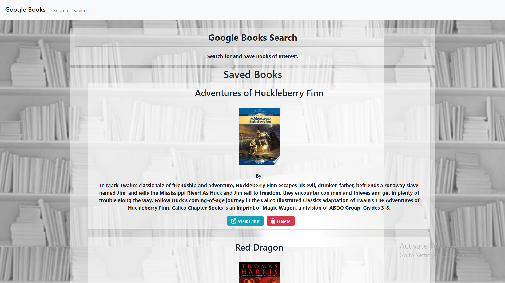
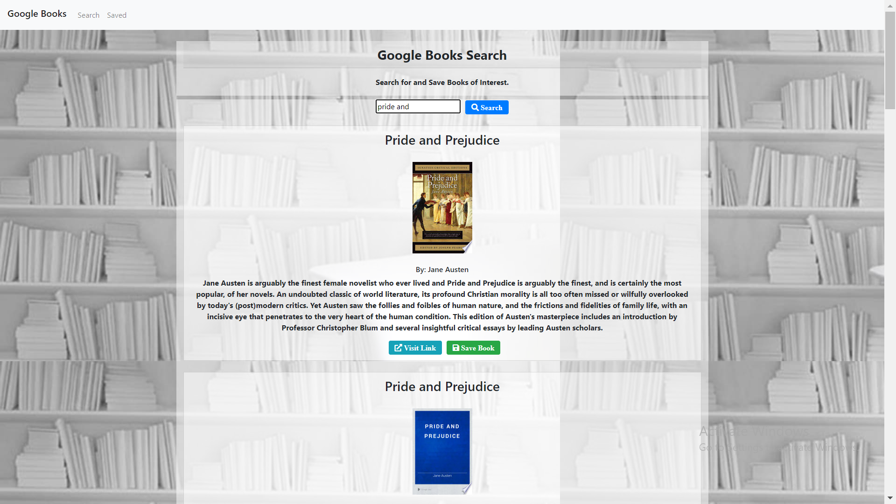

# Google Books Search

## Description

Google Books Search is an app that allows the user to search any book they desire. The data is dynamically populated, and for a book to appear, it has to be searched by title. When a title is submitted, various books with the similar name will populate. Every book is accompanied by an image of the cover, the name of the author, and a brief description. The user will the have the option to click on the `Visit Link` in case they would like the purchase the book. A `Save` button is also available that will store a number of books in the `Saved` page.
In the next page, the user will see the books that have been saved. Along with the `Visit Link` button, ther is also a `Delete` button, so the book can easily be deleted from the list.

## Installation

Employee is installed by first cloning the repo from [Edibozu](https://github.com/Edibozu/google-books-search). Once cloned, the code can be viewed in VS Code. The application itself is deployed on [Heroku](https://google-books-search-ep.herokuapp.com/).
  
This is the main page of the GBS. The navbar at the top is how to navigate between the 2 pages, and saved data is shown for the user to see.
  

  
In the `Search` page, all the user will see is a empty input form. Go ahead and search for a book.
  

  
Once the book if typed and submitted, various works with the same name will populate.
  

   

## Questions

For any questions, contact me on any of the following links:

Email: edibozu@gmail.com

Heroku: https://google-books-search-ep.herokuapp.com/

GitHub Repo: https://github.com/Edibozu/google-books-search

LinkedIn: https://www.linkedin.com/in/eduardo-pineda-5595431b6/

## Contributions

This application was aided by my fellow classmates during our after class study sessions.

## License

MIT License

Copyright (c) [2020] [Eduardo Pineda]

Permission is hereby granted, free of charge, to any person obtaining a copy
of this software and associated documentation files (the "Software"), to deal
in the Software without restriction, including without limitation the rights
to use, copy, modify, merge, publish, distribute, sublicense, and/or sell
copies of the Software, and to permit persons to whom the Software is
furnished to do so, subject to the following conditions:

The above copyright notice and this permission notice shall be included in all
copies or substantial portions of the Software.

THE SOFTWARE IS PROVIDED "AS IS", WITHOUT WARRANTY OF ANY KIND, EXPRESS OR
IMPLIED, INCLUDING BUT NOT LIMITED TO THE WARRANTIES OF MERCHANTABILITY,
FITNESS FOR A PARTICULAR PURPOSE AND NONINFRINGEMENT. IN NO EVENT SHALL THE
AUTHORS OR COPYRIGHT HOLDERS BE LIABLE FOR ANY CLAIM, DAMAGES OR OTHER
LIABILITY, WHETHER IN AN ACTION OF CONTRACT, TORT OR OTHERWISE, ARISING FROM,
OUT OF OR IN CONNECTION WITH THE SOFTWARE OR THE USE OR OTHER DEALINGS IN THE
SOFTWARE.
